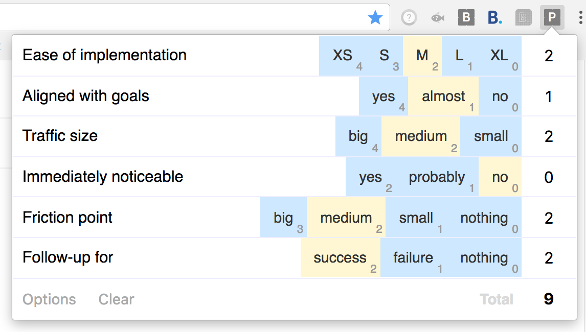

# What is it?
Chrome/Firefox extension to help you prioritize your tasks.
Import your own metrics, open the extension popup, click on (type in) values for every metric and the result would be copied to your clipboard automatically.

### Screenshots


### Options
- On the options page you can import your own metrics.
- Default shortcut to open the popup: Command+Shift+E (Ctrl+Shift+E).
- In Chrome shortcuts can be changed here: chrome://extensions/configureCommands

# How to build
```bash
# Clone the repo
git clone https://github.com/ilya-babanov/priorita.git

# Go to repo's folder
cd priorita

# Insall dependencies (npm should be intsalled and available)
npm install

# Run build script
npm run build
```

# How to install
[Install from Chrome Store](https://chrome.google.com/webstore/detail/priorita/dedgeedhgdcjikdikaaegnlccigmlohn)

## How to install dev version
Before installing build the extension (see the instrictions above)

### Chrome
1. Open chrome://extensions/ tab
2. Enable "Developer mode" checkbox
3. Click on "Load unpacked extension..." button
4. Load `path-to-cloned-repo/dist` directory

### Firefox
1. Open about:debugging tab
2. Click on "Load Temporary Add-on" button
3. Chose `path-to-cloned-repo/dist/manifest.json` file
